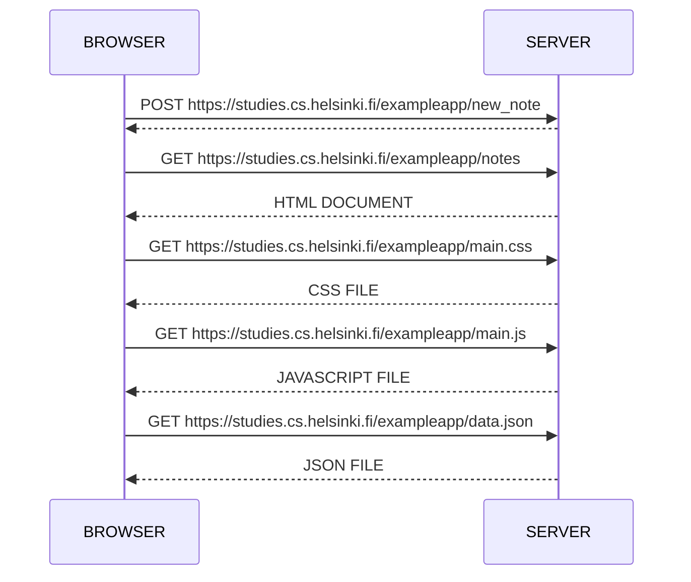

Diagram to describe the creation of a new note by a user:

```mermaid

sequenceDiagram
    participant BROWSER
    participant SERVER
    BROWSER->>SERVER: POST https://studies.cs.helsinki.fi/exampleapp/new_note
    SERVER-->>BROWSER: 
    BROWSER->>SERVER: GET https://studies.cs.helsinki.fi/exampleapp/notes
    SERVER-->>BROWSER: HTML DOCUMENT
    BROWSER->>SERVER: GET https://studies.cs.helsinki.fi/exampleapp/main.css
    SERVER-->>BROWSER: CSS FILE
    BROWSER->>SERVER: GET https://studies.cs.helsinki.fi/exampleapp/main.js
    SERVER-->>BROWSER: JAVASCRIPT FILE
    BROWSER->>SERVER: GET https://studies.cs.helsinki.fi/exampleapp/data.json
    SERVER-->>BROWSER: JSON FILE
```
