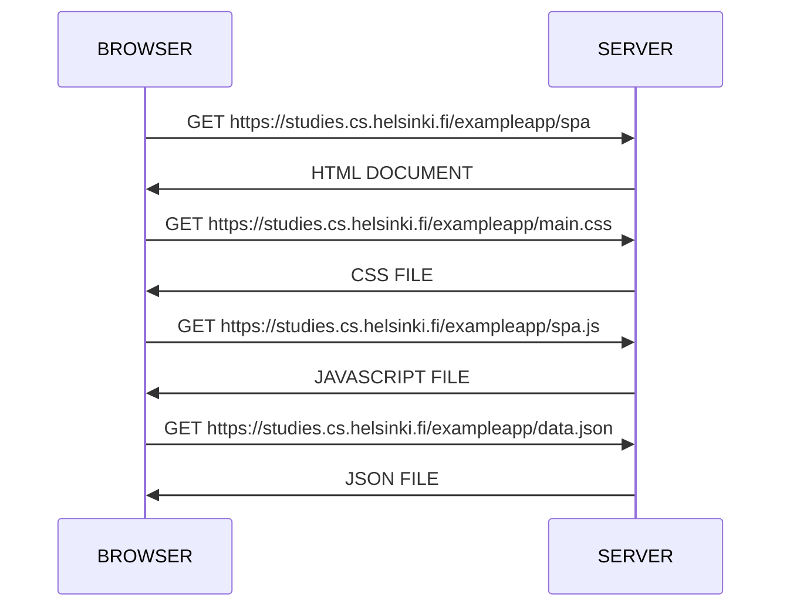

## Diagram describing the user entering a Single Page App page in a browser:

```mermaid
  sequenceDiagram
    participant BROWSER
    participant SERVER
    
    BROWSER->>SERVER: GET https://studies.cs.helsinki.fi/exampleapp/spa
    SERVER->>BROWSER: HTML DOCUMENT
    BROWSER->>SERVER: GET https://studies.cs.helsinki.fi/exampleapp/main.css
    SERVER->>BROWSER: CSS FILE
    BROWSER->>SERVER: GET https://studies.cs.helsinki.fi/exampleapp/spa.js
    SERVER->>BROWSER: JAVASCRIPT FILE
    BROWSER->>SERVER: GET https://studies.cs.helsinki.fi/exampleapp/data.json
    SERVER->>BROWSER: JSON FILE
    
```