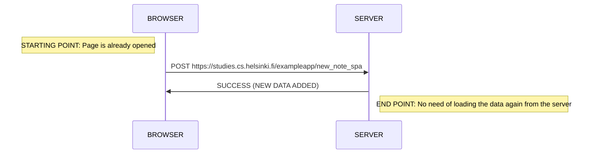

## Diagram describing the user adding a new note to Single Page App in a browser:

```mermaid
  sequenceDiagram
    participant BROWSER
    participant SERVER

    Note left of BROWSER: STARTING POINT: Page is already opened
    BROWSER->>SERVER: POST https://studies.cs.helsinki.fi/exampleapp/new_note_spa
    SERVER->>BROWSER: SUCCESS (NEW DATA ADDED)
    Note right of SERVER: END POINT: No need of loading the data again from the server
```
