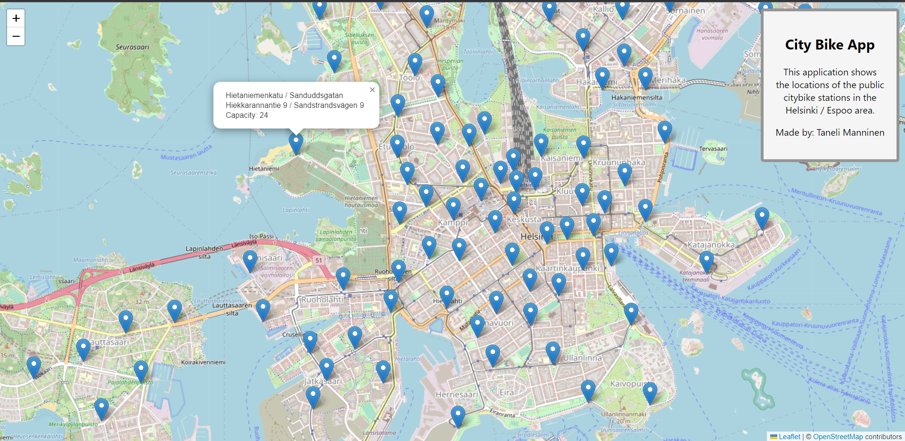

# SOLITA PRE ASSIGNMENT

## Welcome! 

This project is a fullstack application for Solita's Dev Academy pre assignment. Purpose is to make a Helsinki citybike app and the deadline is 31th of May in 2023. 

This assignment came to my attention when I sent an open application to Solita and received instructions to apply to their Dev Academy. Even though I only had just a week to do this assignment due to a planned vacation trip starting on the 20th of May, I still wanted to try my best. That information in mind, my application isn't the most extensive but works just fine and has the functions of a fullstack application.

My final solution for the assignment was to focus on the citybike stations and show them on a map. I chose the most familiar technologies to me for the applicaton. I used Visual Studio Code as the editor, Node.js for the JavaScript based runtime environment, Express for the server framework, MongoDB (Atlas) for the database, Leaflet Maps with React for the user interface.

The application is desktop web application. It shows a mapview zoomed on Helsinki/Espoo region and shows all the citybike station as markers on the map. User can move and zoom in and out freely on the map. When clicking a single marker it shows some essential information about the station. The stations data is saved in a mongodb database and is fetched from the database to the server when the app is launched.

---------------------------------------------------------------------------------------------------------------------------------------------------------------------

## Requirements:

Visual Studio Code 

Node.js

MongoDB (Atlas of Compass)

JavaScript

React

Leaflet Maps

### Installations (root of the project)

First you have to make and name your project folder.

cd your_project_folder (To go to the root of your project folder.)

npm init (Creates a package.json.)

npm install express (Installs the express server network adds a dependency entry in your package.json file.)

npm install mongodb (This will download the MongoDB driver and add a dependency entry in your package.json file.)

npm install mongoose (For MongoDB object modeling tool designed to work in an asynchronous environment.)

npm install cors (Allow connection from different domains and ports.)

npm install --save-dev nodemon (For automatically restarting the node application when file changes in the directory are detected.)

npm install dotenv --save (Loads environment variables from a .env file into process.env.)

Make .env file to the root of project and add variables PORT and MONGODB_URI. PORT can be 3000 for example. In MongodDB, you'll have to make new cluster and get the connection string from there to the MONGODB_URI. Make also a new database named 'helsinki_espoo_citybikes' and collection named 'stations' inside it.

npm i --save csvtojson (To convert csv to json or column arrays.)

npm install --save path 

Add the index.js, utils/config.js with my code to the project. Also add the datasets/Helsingin_ja_Espoon_kaupunkipyora_asemat_avoin.csv to the project. 

In visual studio code, open git bash terminal and write command: curl -X POST -H "Content-Type: application/json" -d '{"path": "path/to/your/csv/file.csv"}' http://localhost:3000/import-csv (Adds the sations data to the mongodb.)

npx create-react-app citybike-app (To install a default react app for the user interface)

### In the root of citybike-app folder:

npm install react react-dom leaflet (React, React DOM and Leaflet are required peer dependencies.)

npm install react-leaflet 

npm run build (This will create a build folder with optimized and minified static files for your React app. Run this every time the react application is modified to work with the backend server.)

Again, add the my code to the App.js and App.css files.

### To launch the project

npm start (Starts the development interface in the citybike-app folder.)

npm run dev (Starts the server in the root of the project.) -> http://localhost:3000 is the address where the application runs when finished.

---------------------------------------------------------------------------------------------------------------------------------------------------------------------

Owner: Taneli Manninen
